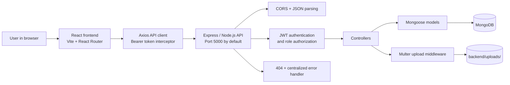
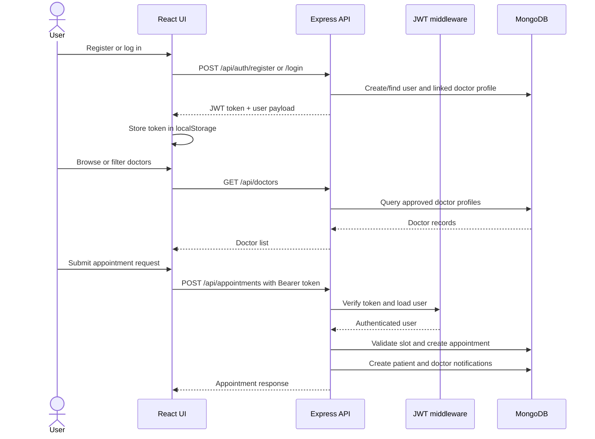

<div align="center">

# Book a Doctor

### A role-based MERN platform for discovering doctors and managing healthcare appointments

[](https://www.mongodb.com/)
[](https://expressjs.com/)
[](https://react.dev/)
[](https://nodejs.org/)
[](https://developer.mozilla.org/en-US/docs/Web/JavaScript)
[](https://vitejs.dev/)

**[Repository](https://github.com/navendhiran007/book-a-doctor)** · **[Backend](backend/)** · **[Frontend](frontend/)**

</div>

## Contents

- [Project Overview](#project-overview)
- [Visual Preview](#visual-preview)
- [Features](#features)
- [Technology Stack](#technology-stack)
- [System Architecture](#system-architecture)
- [Project Structure](#project-structure)
- [Application Workflow](#application-workflow)
- [Database Design](#database-design)
- [API Documentation](#api-documentation)
- [Installation and Local Setup](#installation-and-local-setup)
- [Environment Variables](#environment-variables)
- [Security and Error Handling](#security-and-error-handling)
- [Testing and Deployment](#testing-and-deployment)
- [Future Improvements](#future-improvements)
- [Contributing, License, and Contact](#contributing-license-and-contact)

## Project Overview

Book a Doctor is a full-stack healthcare appointment application built with MongoDB, Express.js, React, and Node.js. It addresses the coordination problem between patients seeking care, doctors managing availability, and administrators reviewing provider registrations.

Patients can register, browse approved doctor profiles, request appointments, upload supporting medical documents, and track notifications. Doctors can maintain their professional profile, define availability, review appointments, and receive relevant notifications. Administrators can review users, doctors, appointments, platform statistics, and doctor approval requests.

The project is technically interesting because it combines a React single-page interface with protected REST APIs, JWT-based role checks, Mongoose relationships, appointment status transitions, multipart document uploads, and role-specific workflows in one codebase.

> **Implementation status:** This README describes the current repository. It does not claim that the application is deployed, tested by an automated suite, or production-ready. Known implementation limitations are listed in [Verified Limitations](#verified-limitations).

## Visual Preview

No application screenshots are currently committed to the repository. The following placeholders intentionally do not represent real screenshots:

| View | Preview status |
| --- | --- |
| Patient dashboard | `Screenshot placeholder - add an image under docs/images/` |
| Doctor dashboard | `Screenshot placeholder - add an image under docs/images/` |
| Administrator dashboard | `Screenshot placeholder - add an image under docs/images/` |

To add real previews later, commit images to a documentation asset directory and replace the placeholders with relative Markdown links, for example:

```markdown

```

## Features

### User Experience

- Public home, about, contact, doctor directory, doctor profile, login, and registration pages.
- Protected patient, doctor, administrator, and notification views using React Router.
- Shared layout, navigation, loading, and alert components.
- Doctor search by name, specialization, location, and approval status through query parameters.

### Authentication and Authorization

- User registration with patient, doctor, or administrator role values accepted by the backend.
- Password hashing with `bcryptjs` before persistence.
- JWT access tokens with a 30-day expiration configured in the authentication controller.
- Bearer-token authentication middleware for protected endpoints.
- Role authorization middleware for administrator-only and doctor/admin operations.
- Frontend session restoration through `GET /api/auth/me` and token attachment through an Axios interceptor.

### Appointment Management

- Patients can create appointment requests with a doctor, date, time, and reason.
- Appointment records support `Pending`, `Confirmed`, `Rejected`, `Cancelled`, and `Completed` statuses.
- Authenticated users can list and view appointments according to the current role logic.
- Appointment status changes create a patient notification.
- The API checks for an existing pending or confirmed appointment at the requested time.

### Doctor and Administration Workflows

- Doctor profiles include specialization, qualification, experience, consultation fee, location, about text, availability, and approval status.
- Doctors can create and update profiles; administrators can update or delete profiles.
- Administrators can list users, doctors, and appointments.
- Administrators can approve or reject doctor registrations.
- Administrator statistics include user, patient, doctor, pending doctor, approved doctor, appointment, and pending appointment counts.

### Documents and Notifications

- Authenticated users can upload, list, download, and delete medical documents.
- Uploads use Multer disk storage and accept `.pdf`, `.jpg`, `.jpeg`, `.png`, `.doc`, and `.docx` files up to 10 MB.
- Documents may be associated with a doctor and appointment.
- Patients, associated doctors, and administrators are checked before document access.
- Users can list notifications, mark one notification as read, or mark all notifications as read.

### Explicitly Not Implemented or Not Verified

- No automated test suite or test script is defined in either `package.json`.
- No deployment configuration, hosting URL, CI workflow, or production database configuration is committed.
- No payment, email, video consultation, rate limiting, cloud file storage, or analytics integration is present in the inspected source.

## Technology Stack

| Layer | Verified technologies | Purpose |
| --- | --- | --- |
| Frontend | React 18, React Router 6, React Bootstrap, Bootstrap 5, Axios, React Icons | Single-page UI, routing, layout components, and API requests |
| Backend | Node.js, Express 4, Mongoose 8, Multer, CORS, dotenv | REST API, persistence, uploads, cross-origin requests, and configuration |
| Database | MongoDB | Stores users, doctor profiles, appointments, documents, and notifications |
| Authentication | `jsonwebtoken`, `bcryptjs` | JWT issuance/verification and password hashing |
| Development | Vite 5, Nodemon, ESLint | Frontend development/build, backend reloads, and linting |
| Deployment | Not configured in this repository | Deployment target and hosting provider are not specified |

## System Architecture

The browser runs the React/Vite frontend. Axios sends JSON or multipart requests to the Express API. Protected requests pass through JWT and role middleware before controllers read or update MongoDB through Mongoose. The backend also writes uploaded files to its local `backend/uploads/` directory.



### Request Boundary

1. A public or protected React page calls the Axios client.
2. The client uses `VITE_API_URL` when defined; otherwise it uses `/api`.
3. The backend parses JSON or URL-encoded payloads and routes the request by resource.
4. Protected routes validate a Bearer JWT and load the user without the password field.
5. Controllers validate required fields, enforce resource ownership or role rules, and call Mongoose.
6. The API returns JSON responses with a `success` flag, resource data, counts, or an error message.

## Project Structure

```text
book-a-doctor/
├── .gitignore
├── README.md
├── backend/
│   ├── .env.example
│   ├── config/
│   │   └── db.js
│   ├── controllers/
│   │   ├── adminController.js
│   │   ├── appointmentController.js
│   │   ├── authController.js
│   │   ├── doctorController.js
│   │   ├── documentController.js
│   │   └── notificationController.js
│   ├── middleware/
│   │   ├── authMiddleware.js
│   │   ├── errorMiddleware.js
│   │   └── uploadMiddleware.js
│   ├── models/
│   │   ├── Appointment.js
│   │   ├── Doctor.js
│   │   ├── Document.js
│   │   ├── Notification.js
│   │   └── User.js
│   ├── routes/
│   │   ├── adminRoutes.js
│   │   ├── appointmentRoutes.js
│   │   ├── authRoutes.js
│   │   ├── doctorRoutes.js
│   │   ├── documentRoutes.js
│   │   └── notificationRoutes.js
│   ├── uploads/
│   │   └── .gitkeep
│   ├── package.json
│   ├── package-lock.json
│   ├── seed.js
│   └── server.js
└── frontend/
    ├── src/
    │   ├── components/
    │   ├── context/
    │   ├── layouts/
    │   ├── pages/
    │   ├── services/
    │   ├── App.jsx
    │   ├── index.css
    │   └── main.jsx
    ├── index.html
    ├── package.json
    ├── package-lock.json
    └── vite.config.js
```

| Directory or file | Responsibility |
| --- | --- |
| `backend/server.js` | Loads environment variables, connects to MongoDB, registers middleware/routes, and starts Express |
| `backend/config/db.js` | Creates the Mongoose connection |
| `backend/controllers/` | Implements request validation, authorization checks, database operations, and responses |
| `backend/models/` | Defines Mongoose schemas and MongoDB model relationships |
| `backend/routes/` | Maps HTTP methods and paths to controllers and middleware |
| `backend/middleware/` | Handles JWT auth, role checks, file uploads, 404s, and errors |
| `frontend/src/pages/` | Public and role-specific route views |
| `frontend/src/context/AuthContext.jsx` | Stores the current user/token state and login/register/logout actions |
| `frontend/src/services/api.js` | Configures Axios and attaches the JWT from local storage |

## Application Workflow

The normal patient workflow is registration or login, doctor discovery, appointment request, and notification tracking. Doctor registration creates both a `User` and a pending `Doctor` profile; an administrator can approve that profile before it is intended to appear in the public doctor listing.



## Database Design

The repository defines five Mongoose models. Timestamps are enabled on all five schemas. No custom database indexes are declared beyond the schema-level uniqueness constraint on `User.email`.

```mermaid
erDiagram
    USER ||--o| DOCTOR : "has profile"
    USER ||--o{ APPOINTMENT : "patient requests"
    DOCTOR ||--o{ APPOINTMENT : "receives"
    USER ||--o{ DOCUMENT : "uploads"
    DOCTOR ||--o{ DOCUMENT : "may receive"
    APPOINTMENT ||--o{ DOCUMENT : "may include"
    USER ||--o{ NOTIFICATION : "receives"

    USER {
        ObjectId _id PK
        string name required
        string email unique
        string password_hashed
        string phone
        string role "patient|doctor|admin"
        string profileImage
    }
    DOCTOR {
        ObjectId _id PK
        ObjectId userId FK
        string specialization required
        string qualification required
        string experience required
        number consultationFee min_0
        string location required
        string about
        string availability
        string approvalStatus "pending|approved|rejected"
    }
    APPOINTMENT {
        ObjectId _id PK
        ObjectId patientId FK
        ObjectId doctorId FK
        string appointmentDate
        string appointmentTime
        string reason
        string status "Pending|Confirmed|Rejected|Cancelled|Completed"
    }
    DOCUMENT {
        ObjectId _id PK
        ObjectId patientId FK
        ObjectId doctorId FK
        ObjectId appointmentId FK
        string fileName
        string filePath
        string fileType
        number fileSize
        date uploadedAt
    }
    NOTIFICATION {
        ObjectId _id PK
        ObjectId userId FK
        string message
        string type "info|appointment|admin|status"
        boolean readStatus
    }
```

### Validation and Relationship Notes

- `User.email` is required, lowercased, trimmed, and marked unique; `role` is limited to `patient`, `doctor`, or `admin`.
- `User.password` has a minimum length of six characters and is removed from JSON output by the schema's `toJSON` method.
- `Doctor.consultationFee` cannot be negative; doctor approval is limited to `pending`, `approved`, or `rejected`.
- `Appointment.status` and `Notification.type` use enumerated values.
- `Document.doctorId` and `Document.appointmentId` are optional references; `patientId` is required.
- The application uses Mongoose `populate` for selected patient, doctor, and appointment fields in relevant controllers.

## API Documentation

Base URL: `http://localhost:5000` by default. The frontend normally calls the API through `/api`; set `VITE_API_URL` when a different API base is needed.

`Protected` means the request requires `Authorization: Bearer <JWT>`. `Admin` and `Doctor/Admin` also require the corresponding role.

### Health and Authentication

| Method | Endpoint | Auth | Purpose | Body/query |
| --- | --- | --- | --- | --- |
| `GET` | `/` | Public | Backend health response with status message and timestamp | None |
| `POST` | `/api/auth/register` | Public | Create a user and, for doctor registration, a pending doctor profile | `name`, `email`, `password`; optional `phone`, `role`, doctor profile fields |
| `POST` | `/api/auth/login` | Public | Verify credentials and return a JWT plus user data | `email`, `password` |
| `GET` | `/api/auth/me` | Protected | Return the authenticated user and doctor profile when applicable | None |

### Doctors

| Method | Endpoint | Auth | Purpose | Body/query |
| --- | --- | --- | --- | --- |
| `GET` | `/api/doctors` | Public | List doctors, defaulting to approved profiles | Optional `name`, `specialization`, `location`, `status` query parameters |
| `GET` | `/api/doctors/:id` | Public | Retrieve one doctor profile | Path `id` |
| `POST` | `/api/doctors` | Doctor/Admin | Create a doctor profile | Profile fields and optional `availability` |
| `PUT` | `/api/doctors/:id` | Doctor/Admin | Update a doctor profile after ownership check | Fields to update in request body |
| `DELETE` | `/api/doctors/:id` | Admin | Delete a doctor profile | Path `id` |

### Appointments

| Method | Endpoint | Auth | Purpose | Body/query |
| --- | --- | --- | --- | --- |
| `POST` | `/api/appointments` | Protected | Create a pending appointment request and notifications | `doctorId`, `appointmentDate`, `appointmentTime`, `reason` |
| `GET` | `/api/appointments` | Protected | List appointments using the current role filter | None |
| `GET` | `/api/appointments/:id` | Protected | Read an appointment after access validation | Path `id` |
| `PUT` | `/api/appointments/:id` | Protected | Update status and notify the patient | `status`: `Pending`, `Confirmed`, `Rejected`, `Cancelled`, or `Completed` |
| `DELETE` | `/api/appointments/:id` | Protected | Delete an appointment; controller restricts this to admins | Path `id` |

### Documents

| Method | Endpoint | Auth | Purpose | Body/query |
| --- | --- | --- | --- | --- |
| `POST` | `/api/documents/upload` | Protected | Store a medical document record and local file | Multipart field `document`; optional `doctorId`, `appointmentId` |
| `GET` | `/api/documents` | Protected | List documents using patient/doctor role filters | None |
| `GET` | `/api/documents/:id/download` | Protected | Download a document after permission validation | Path `id` |
| `DELETE` | `/api/documents/:id` | Protected | Delete a document record and local file | Path `id` |

### Notifications

| Method | Endpoint | Auth | Purpose | Body/query |
| --- | --- | --- | --- | --- |
| `GET` | `/api/notifications` | Protected | List the current user's notifications | None |
| `PUT` | `/api/notifications/:id/read` | Protected | Mark one owned notification as read | Path `id` |
| `PUT` | `/api/notifications/read-all` | Protected | Mark all current-user notifications as read | None |

### Administration

| Method | Endpoint | Auth | Purpose | Body/query |
| --- | --- | --- | --- | --- |
| `GET` | `/api/admin/users` | Admin | List users without password fields | None |
| `GET` | `/api/admin/doctors` | Admin | List all doctor profiles | None |
| `GET` | `/api/admin/appointments` | Admin | List all appointments with selected populated fields | None |
| `GET` | `/api/admin/stats` | Admin | Return platform counts | None |
| `PUT` | `/api/admin/doctors/:id/approve` | Admin | Approve a doctor and send a notification | Path `id` |
| `PUT` | `/api/admin/doctors/:id/reject` | Admin | Reject a doctor and send a notification | Path `id` |

All controllers return JSON objects with `success` and resource-specific fields unless the endpoint returns a file download. Error responses include `success: false` and a message.

## Installation and Local Setup

### Prerequisites

- Node.js and npm. The repository does not declare an `engines` field; Node.js 18+ is a practical baseline for the current dependencies.
- A running MongoDB instance. The checked-in example uses a local database named `book_a_doctor`.
- Git for cloning the repository.

### 1. Clone and install

```bash
git clone https://github.com/navendhiran007/book-a-doctor.git
cd book-a-doctor

cd backend
npm install

cd ../frontend
npm install
```

### 2. Configure the backend

From `backend/`, copy the safe template to a local environment file:

```powershell
# Windows PowerShell
Copy-Item .env.example .env
```

```bash
# macOS/Linux
cp .env.example .env
```

Set a unique JWT secret before using the application. Do not commit `.env`.

### 3. Start MongoDB

Start MongoDB using your local installation or configured MongoDB service. The default connection is:

```text
mongodb://localhost:27017/book_a_doctor
```

You may replace `MONGO_URI` with a development MongoDB deployment URI in `backend/.env`.

### 4. Run both applications

Backend terminal:

```bash
cd backend
npm run dev
```

Frontend terminal:

```bash
cd frontend
npm run dev
```

The backend defaults to `http://localhost:5000`. Vite prints the frontend URL when it starts, commonly `http://localhost:5173`; confirm the actual port in the terminal because no fixed port is documented in `vite.config.js`.

### 5. Optional seed data

The repository includes a development seeder for one admin, three approved sample doctors, and one sample patient:

```bash
cd backend
node seed.js
```

The seed file contains development-only sample credentials. Use them only in a local database and change them before any deployment.

## Environment Variables

| Variable | Location | Required? | Purpose | Safe example |
| --- | --- | --- | --- | --- |
| `PORT` | `backend/.env` | No | Express listening port; defaults to `5000` | `5000` |
| `MONGO_URI` | `backend/.env` | Yes for configured database access | MongoDB connection string; the code has a local fallback | `mongodb://localhost:27017/book_a_doctor` |
| `JWT_SECRET` | `backend/.env` | Strongly required | Signs and verifies 30-day JWTs | `replace-with-a-long-random-secret` |
| `NODE_ENV` | `backend/.env` | No | Controls whether error responses include stack traces | `development` |
| `VITE_API_URL` | `frontend/.env` | No | Overrides the Axios base URL; defaults to `/api` | `http://localhost:5000/api` |

Only `PORT`, `MONGO_URI`, `JWT_SECRET`, and `NODE_ENV` are listed in the checked-in backend template. `VITE_API_URL` is verified in the frontend source but has no checked-in frontend `.env.example`.

## Security and Error Handling

### Implemented

- Passwords are hashed with `bcryptjs` and are excluded from user JSON output.
- JWTs are verified by middleware, with user lookup and password exclusion before protected controllers run.
- Role checks restrict administrator routes and doctor/admin profile operations.
- Ownership checks protect appointment, document, and notification access in their controllers.
- CORS, JSON parsing, and URL-encoded body parsing are registered in the Express server.
- Multer restricts upload extensions and enforces a 10 MB file-size limit.
- A 404 middleware and centralized JSON error handler are registered after the routes.
- Environment files, dependency folders, and runtime uploads are ignored by the root `.gitignore`.

### Recommendations before production

- Replace the code fallback JWT secret with a required environment variable and rotate any exposed development secrets.
- Restrict CORS to known frontend origins instead of the current permissive configuration.
- Add request validation, rate limiting, security headers, structured logging, and a production-grade file storage/access strategy.
- Avoid returning stack traces in any non-development environment and add malware/content validation for medical uploads.
- Consider a secure, httpOnly cookie or another hardened token strategy instead of browser local storage.

## Verified Limitations

The following observations come directly from the current source and should be addressed before presenting the application as production-ready:

1. `backend/controllers/doctorController.js` references `doctorId` instead of `req.params.id` in `getDoctorById`, so the doctor detail endpoint requires a fix before it can reliably resolve a profile.
2. Appointment creation and appointment list filtering use different identifier assumptions for doctor profiles and doctor users. This should be reconciled around one documented relationship before relying on doctor appointment views.
3. Doctor approval values are stored by the schema as lowercase (`approved`, `pending`, `rejected`), while parts of the controller query and creation logic use capitalized values such as `Approved` and `Pending`. These values should be normalized before relying on approval filtering.
4. The backend package has no test script, and no automated test files were found in the repository.
5. The repository has no deployment configuration, CI workflow, screenshots, root `LICENSE` file, or verified production URL.

## Testing and Deployment

### Testing status

No automated tests are currently configured. The available quality checks are:

```bash
cd frontend
npm run lint
npm run build
```

The backend package currently provides `npm start` and `npm run dev`, but no backend lint or test command.

### Deployment preparation checklist

Deployment is not configured in this repository. Before deploying, add and verify:

- A managed MongoDB connection and production `MONGO_URI`.
- A generated `JWT_SECRET` stored in the hosting provider's secret manager.
- A production `NODE_ENV` and restricted CORS origin.
- Persistent/private storage for medical documents rather than ephemeral local disk.
- Frontend `VITE_API_URL` pointing to the deployed API.
- Backend and frontend build/start commands appropriate to the selected host.
- HTTPS, upload access controls, backups, monitoring, and a privacy/compliance review for healthcare data.

## Future Improvements

These are recommendations, not current features:

- Add unit and integration tests for authentication, role authorization, appointment conflicts, document permissions, and admin actions.
- Fix and test the doctor/profile and appointment identifier relationships noted above.
- Add schema and request validation with consistent error formats.
- Add pagination and indexes for doctor search, appointments, documents, notifications, and admin lists.
- Move medical documents to private object storage with signed, expiring downloads.
- Add password reset, email notifications, audit logging, and stronger session management.
- Add CI for linting, frontend builds, backend checks, and dependency auditing.
- Add real screenshots, accessibility checks, and a documented deployment environment.

## Contributing, License, and Contact

### Contributing

1. Fork the repository and create a focused feature branch from `main`.
2. Keep application changes separate from documentation or formatting changes.
3. Update the README when behavior, endpoints, scripts, or environment variables change.
4. Run `npm run lint` and `npm run build` in `frontend/` before opening a pull request.
5. Do not commit `.env` files, credentials, dependency directories, medical uploads, or generated build output.

### License

No root `LICENSE` file is present. The backend `package.json` declares the `ISC` license, while the frontend package is marked private and does not declare a license. Add a root license file and update package metadata before distributing this project as open source.

### Contact and repository

The verified project repository is [navendhiran007/book-a-doctor](https://github.com/navendhiran007/book-a-doctor). No separate author email or profile link is declared in the repository, so none is listed here.